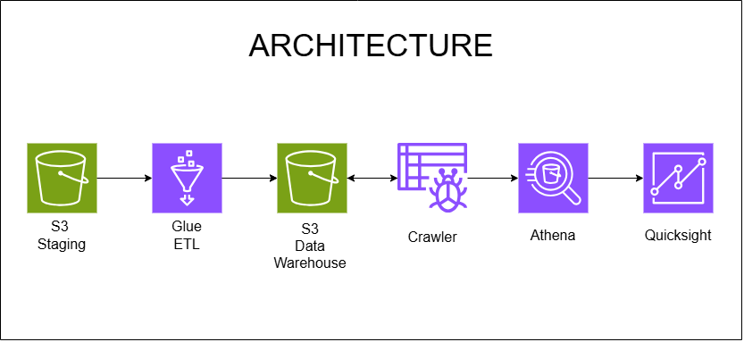
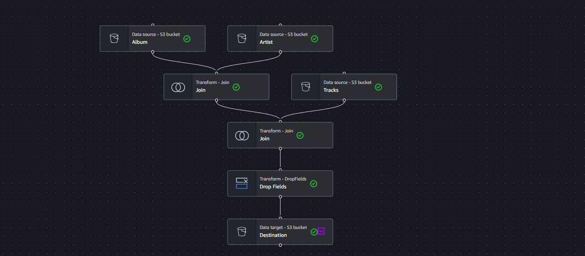
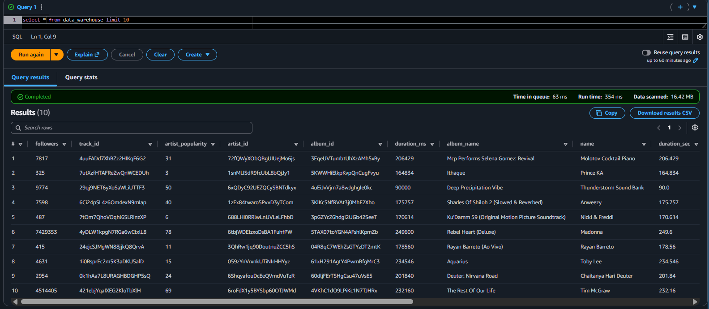
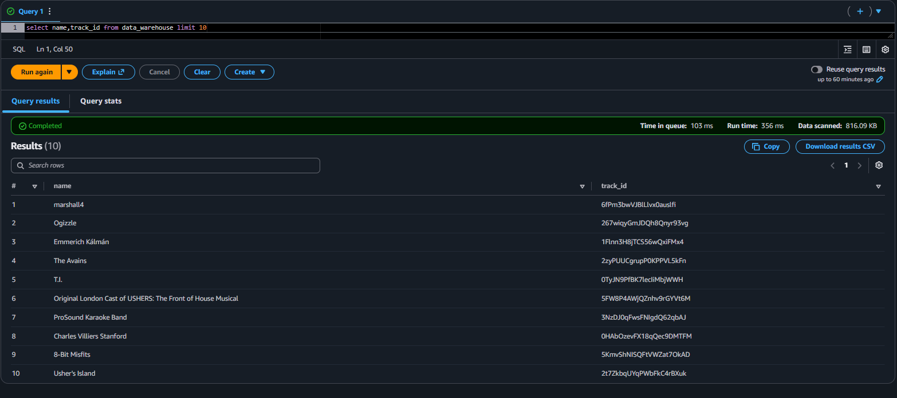

# Spotify Data Engineering Pipeline

An end-to-end **cloud data engineering pipeline** built using AWS and
PySpark to ingest, transform, store, catalog, query, and analyze Spotify
data.

The project demonstrates a practical AWS data engineering workflow using
**Amazon S3, AWS Glue, PySpark, Glue Crawler, Amazon Athena, and Amazon
QuickSight**.

------------------------------------------------------------------------

## Architecture



### End-to-End Data Flow

``` text
Spotify Dataset
      |
      v
Amazon S3 - Staging
      |
      v
AWS Glue ETL + PySpark
      |
      v
Amazon S3 - Processed Data Layer
      |
      v
AWS Glue Crawler
      |
      v
AWS Glue Data Catalog
      |
      v
Amazon Athena
      |
      v
Amazon QuickSight
```

------------------------------------------------------------------------

## Project Overview

The goal of this project is to build a scalable and serverless data
pipeline for Spotify data.

Multiple raw Spotify datasets are first uploaded to Amazon S3. AWS Glue
is then used to perform ETL operations, including joining datasets,
transforming columns, and removing unnecessary fields. The processed
data is stored back in S3.

A Glue Crawler discovers the schema and creates metadata in the Glue
Data Catalog. Amazon Athena is then used to query the processed data
using SQL. The resulting data can be connected to Amazon QuickSight for
interactive dashboards and visualization.

------------------------------------------------------------------------

## Technologies Used

  Technology                  Purpose
  --------------------------- ----------------------------------------
  **Amazon S3**               Raw and processed data storage
  **AWS Glue**                Serverless ETL and data integration
  **PySpark**                 Data transformation and processing
  **AWS Glue Crawler**        Automatic schema discovery
  **AWS Glue Data Catalog**   Metadata and table management
  **Amazon Athena**           Serverless SQL analytics
  **Amazon QuickSight**       Data visualization and dashboards
  **Git & GitHub**            Version control and project management

------------------------------------------------------------------------

## Datasets

The pipeline works with multiple Spotify datasets, including:

-   **Artist data**
-   **Album data**
-   **Track data**

These datasets contain attributes such as:

-   Artist ID
-   Artist name
-   Artist popularity
-   Followers
-   Album ID
-   Album name
-   Track ID
-   Track name
-   Track duration

The datasets are stored in Amazon S3 before processing.

------------------------------------------------------------------------

# Data Engineering Pipeline

## 1. Data Ingestion --- Amazon S3

The raw Spotify datasets are uploaded to an Amazon S3 staging location.

``` text
Raw Spotify Data
       |
       v
Amazon S3
   Staging Layer
```

S3 provides scalable and durable cloud storage for the raw data.

------------------------------------------------------------------------

## 2. ETL Processing --- AWS Glue

AWS Glue is used to build the ETL workflow.

The pipeline reads multiple datasets from S3 and combines them using
join transformations.

### Glue ETL Workflow



The ETL workflow includes:

1.  Reading the **Album** dataset from S3
2.  Reading the **Artist** dataset from S3
3.  Joining Album and Artist data
4.  Reading the **Tracks** dataset from S3
5.  Joining the combined data with Tracks
6.  Dropping unnecessary fields
7.  Writing the final processed dataset to S3

### Transformation Flow

``` text
Album Dataset ──────┐
                    |
                    v
                  JOIN
                    ^
                    |
Artist Dataset ─────┘
                    |
                    v
              Joined Dataset
                    |
                    +──────── Tracks Dataset
                    |                |
                    └────── JOIN ───┘
                            |
                            v
                       Drop Fields
                            |
                            v
                    Processed Dataset
                            |
                            v
                           S3
```

------------------------------------------------------------------------

## 3. Data Storage --- Amazon S3

After transformation, the processed dataset is stored in a separate S3
location.

For analytical workloads, the processed data can be stored in **Parquet
format with Snappy compression**.

### Why Parquet?

-   Columnar storage
-   Efficient analytical queries
-   Reduced storage requirements
-   Faster data scanning

### Why Snappy?

Snappy provides fast compression and decompression, making it well
suited for big-data processing.

``` text
Processed Data
      |
      v
Parquet Format
      |
      v
Snappy Compression
      |
      v
Amazon S3
```

> In this project, the S3 processed-data layer is treated as the data
> lake/storage layer. Amazon Athena provides the SQL query layer over
> the data.

------------------------------------------------------------------------

## 4. Schema Discovery --- AWS Glue Crawler

The AWS Glue Crawler scans the processed data in S3 and automatically
discovers its schema.

It identifies:

-   Column names
-   Data types
-   Table structure
-   Partitions, when applicable

The metadata is stored in the **AWS Glue Data Catalog**.

``` text
S3 Processed Data
       |
       v
Glue Crawler
       |
       v
Glue Data Catalog
       |
       v
Cataloged Table
```

This allows Athena to understand the structure of the data without
manually defining every column.

------------------------------------------------------------------------

# Data Analysis --- Amazon Athena

Amazon Athena is used to query the processed Spotify data directly using
SQL.

## Query 1 --- Preview the Data

``` sql
SELECT *
FROM data_warehouse
LIMIT 10;
```

### Query Result



This query was used to verify that the transformed data was successfully
loaded and accessible through Athena.

The result contains fields such as:

-   Followers
-   Track ID
-   Artist Popularity
-   Artist ID
-   Album ID
-   Duration
-   Album Name
-   Track Name
-   Duration in Seconds

------------------------------------------------------------------------

## Query 2 --- Select Specific Columns

``` sql
SELECT name, track_id
FROM data_warehouse
LIMIT 10;
```

### Query Result



This query demonstrates how specific fields can be selected from the
cataloged Spotify dataset.

------------------------------------------------------------------------

# Analytics

The processed Spotify dataset can be used to generate several analytical
insights.

### Example Questions

-   Which artists have the highest popularity?
-   Which tracks have the highest popularity?
-   Which artists have the most followers?
-   What is the average track duration?
-   Which albums contain the most tracks?
-   How are tracks distributed by popularity?
-   Which artists have the highest number of tracks?
-   How does artist popularity relate to followers?

### Example SQL

``` sql
SELECT
    name,
    AVG(artist_popularity) AS avg_artist_popularity
FROM data_warehouse
GROUP BY name
ORDER BY avg_artist_popularity DESC;
```

------------------------------------------------------------------------

# Visualization --- Amazon QuickSight

Amazon QuickSight can be used as the visualization layer on top of the
Athena data.

The processed data can be used to build dashboards containing:

-   Top Artists
-   Top Tracks
-   Artist Popularity
-   Followers by Artist
-   Average Track Duration
-   Album Analysis
-   Popularity Distribution

``` text
Amazon Athena
      |
      v
QuickSight Dataset
      |
      v
Interactive Dashboard
```

> If QuickSight is not available for your AWS account, the same Athena
> output can be visualized using another BI tool such as Power BI.

------------------------------------------------------------------------

# Complete Architecture

``` text
                     Spotify Data
                          |
                          v
                 +------------------+
                 |    Amazon S3     |
                 |  Staging Layer   |
                 +--------+---------+
                          |
                          v
                 +------------------+
                 |    AWS Glue      |
                 | ETL + PySpark    |
                 +--------+---------+
                          |
                          v
                 +------------------+
                 |    Amazon S3     |
                 | Processed Layer  |
                 +--------+---------+
                          |
                          v
                 +------------------+
                 |   Glue Crawler   |
                 +--------+---------+
                          |
                          v
                 +------------------+
                 | Glue Data Catalog|
                 +--------+---------+
                          |
                          v
                 +------------------+
                 |  Amazon Athena   |
                 |   SQL Analytics  |
                 +--------+---------+
                          |
                          v
                 +------------------+
                 | Amazon QuickSight|
                 |  Visualization   |
                 +------------------+
```

------------------------------------------------------------------------

# Key Features

-   End-to-end AWS data engineering pipeline
-   Cloud-based data ingestion using Amazon S3
-   Serverless ETL using AWS Glue
-   PySpark-based data transformation
-   Joining multiple Spotify datasets
-   Data cleaning and field selection
-   Parquet-based processed data storage
-   Snappy compression
-   Automated schema discovery using Glue Crawler
-   Metadata management using Glue Data Catalog
-   SQL analytics using Amazon Athena
-   Dashboard-ready data for QuickSight

------------------------------------------------------------------------

# Project Structure

``` text
Spotify-Data-Engineering-Pipeline/
|
├── data/
|   └── README.md
|
├── scripts/
|   └── spotify_etl.py
|
├── notebooks/
|   └── spotify_analysis.ipynb
|
├── architecture.png
├── glue_etl_workflow.png
├── athena_query_results.png
├── athena_column_query.png
├── README.md
└── requirements.txt
```

Adjust the folder structure above to match the actual files in your
repository.

------------------------------------------------------------------------

# Project Workflow Summary

  Stage   AWS Service         Work Performed
  ------- ------------------- -----------------------------
  1       Amazon S3           Store raw Spotify data
  2       AWS Glue            Run ETL workflow
  3       PySpark             Transform and join datasets
  4       Amazon S3           Store processed data
  5       Glue Crawler        Discover schema
  6       Glue Data Catalog   Store metadata
  7       Amazon Athena       Run SQL queries
  8       Amazon QuickSight   Visualize insights

------------------------------------------------------------------------

# Learning Outcomes

Through this project, I gained practical experience in:

-   Designing cloud-based data pipelines
-   Working with Amazon S3
-   Building ETL workflows with AWS Glue
-   Using PySpark for data transformation
-   Joining multiple datasets
-   Working with Parquet and Snappy compression
-   Using Glue Crawlers and the Data Catalog
-   Performing SQL analytics with Athena
-   Preparing cloud data for BI dashboards
-   Understanding an end-to-end data engineering architecture

------------------------------------------------------------------------

# Future Improvements

The pipeline can be further improved by:

-   Automating ETL execution using scheduled triggers
-   Implementing incremental data processing
-   Adding data quality validation
-   Partitioning large datasets for better Athena performance
-   Adding additional Spotify datasets
-   Implementing pipeline monitoring and logging
-   Creating automated dashboard refreshes
-   Adding more advanced analytical queries

------------------------------------------------------------------------

# Author

**Sangamesh Daregave**

Computer Science Undergraduate

Interested in **Data Engineering, Cloud Computing, Big Data, AWS, and
PySpark**.

------------------------------------------------------------------------

## License

This project is created for educational and portfolio purposes.
